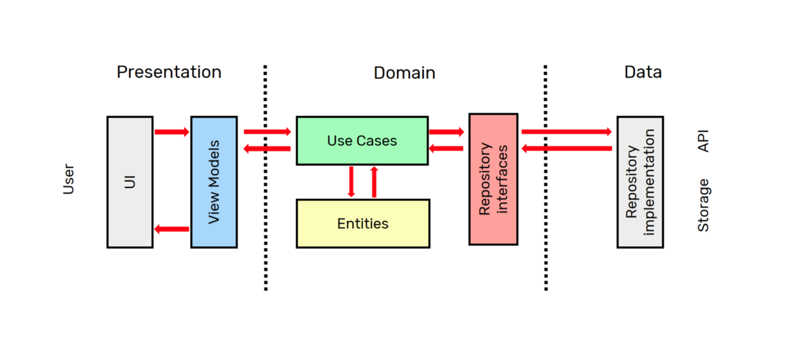
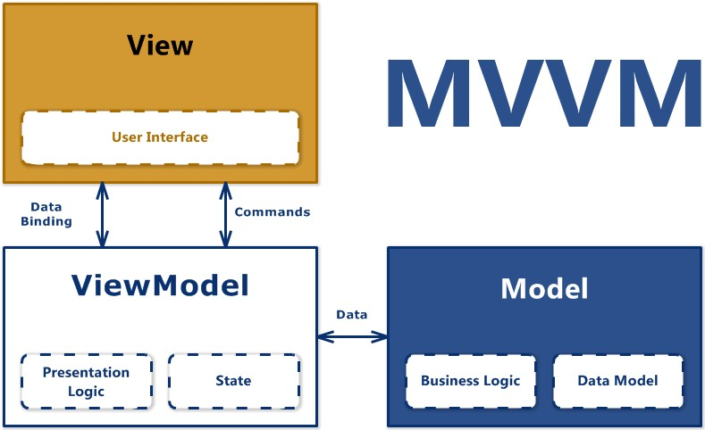

# Clean Architecture

Layers are not a novel concept. They have existed in the industry for more than a couple of decades (some of you reading this document are probably younger than layers) and are one of the first architectural styles created. In short, layers are simply dividing the responsibilities of your application into different layers, where upper layers can talk to lower layers, but not vice versa.

Layers interact through facades, so a layer does not have to know anything about the internal implementation details of other layers.

Translating this into a React application, what we will do is have a UI layer where components with React's reactivity live, where we write React components with _no_ business logic. Behind this layer, we will have an application layer where we will model the use cases of the application; here we begin to interact with our business logic, and finally, we will have our domain layer, where the most important part of our application lives, because this layer _must not_ have any kind of external dependencies.

For a small application, perhaps having a UI layer and another domain or view model layer will suffice, and probably this is how we have been writing React applications for a long time. But as applications grow, these layers get thicker and start to do too much, making them harder to reason about.

Before continuing, I would like to talk a bit about the benefits of separating our project into layers.

### **Ease of reasoning**

Divide and conquer: the best way to solve a big problem is to divide it into smaller problems that are easier to solve. We can reason about one layer independently without worrying about the implementation of other layers.

### **Substitution**

Layers can be easily substituted with alternative implementations. It’s not like we change our HTTP library every day, but when the time comes, the change is autonomous within one layer and should never leak outside the boundaries of the layer. Refactoring becomes easier and less intrusive.

### **Evolution**

Architectures that scale must have the ability to evolve as software matures and requirements change. Although we like to do some design upfront, there are things that only appear after development starts. By using layers, we can delay decisions about implementation details until we have enough information to make a sensible decision.

### **Decoupling**

Dependencies between layers are controlled as they are unidirectional. Aiming for low coupling (while maintaining high cohesion) is a good way to prevent our application from becoming a big ball of mud.

### **Testability**

Having a layered architecture allows you to test each component in isolation and easily. Although this is good, in my opinion it’s not the biggest benefit in terms of testing. For me, the biggest benefit of layered architectures is that it is easier to write tests while working on the code. Since each layer must have a well-defined responsibility, it’s easier to think about what’s worth testing during implementation.

All the above helps us write code that is easier to maintain. A maintainable codebase makes us more productive, as we spend less time fighting technical debt and more time working on new features. It also reduces the risk when introducing changes. Last but not least, it makes our code easier to test, which ultimately gives us more confidence during development and refactoring.

Now that we know the benefits of layers and layered architectures, let’s talk about what kind of layered architecture we are proposing for a large React application.

# **CLEAN architecture**

Clean architecture is a type of layered architecture composed of several ideas from other layered architectures, such as onion architecture, hexagonal architecture, and ports and adapters architecture, among others.

The core idea behind Clean is to put the business and business entities at the centre of our application. The outer layers are less business-specific, while the inner layers deal with business.

We will briefly describe what each layer does in clean architecture to understand how we can leverage some of these concepts in our React applications.

But first, I would like to comment on the type of relationship that will exist between the view and the use cases; for this, we will base ourselves on the MVVM Model-View-ViewModel structure.

This structure is very easy to understand. The view simply takes care of presenting the information received from the ViewModel. The ViewModel is primarily responsible for defining the presentation logic and managing the internal state of this view, and for interacting with the Model, where the business logic resides.

Clean architecture, a diagram

### **Entities**

At the centre of the diagram, we have entities. In classic clean architecture, entities are a means of containing the state related to business rules. Entities should be simple data structures and have no knowledge of our UI framework or library.

For a frontend application, this is where we have the logic related to the entities of our system.

### **Use Cases**

Use cases are close to user stories in agile terminology. This is where the business rules of the application live. A use case should represent something a user wants to achieve. Use cases should have all the code to make that happen in a way that makes sense for the application. Note that use cases can only depend on inner layers, so for things to happen inside a use case (say, making an HTTP request), we must inject dependencies into our use case and apply _inversion of control_.

### **Controllers / Presenters / Gateways**

This layer contains code from our framework or library that implements the use cases. Generally, the UI layer would call the methods exposed by the controllers or presenters.

### **Framework & Drivers**

The outermost layer is where all the IO operations live. User input, HTTP connections, reading from web storage, etc. This is where our UI framework lives.

It’s worth noting that, like any other layered architecture, we can add as many layers as needed. Although the simpler, the better!

## **References**

-   Martin Fowler -- Catalog of Patterns of Enterprise Application Architecture <https://martinfowler.com/eaaCatalog/domainModel.html>
-   Denis Brandi -- Why you need use cases interactors <https://proandroiddev.com/why-you-need-use-cases-interactors-142e8a6fe576>
-   Bob Martin -- The Clean Architecture <https://blog.cleancoder.com/uncle-bob/2012/08/13/the-clean-architecture.html>
-   Daniel Mackay -- Clean Architecture, an introduction <https://www.dandoescode.com/blog/clean-architecture-an-introduction/>
-   CodingWithMitch -- 2 Key Concepts of Clean Architecture <https://www.youtube.com/watch?v=NyJLw3sc17M>
-   Frank Bos and Fouad Astitou -- Fuck CLEAN Architecture <https://www.youtube.com/watch?v=zkmcy9WQqUE>
-   Ian Cooper, The Clean Architecture <https://www.youtube.com/watch?v=SxJPQ5qXisw>
