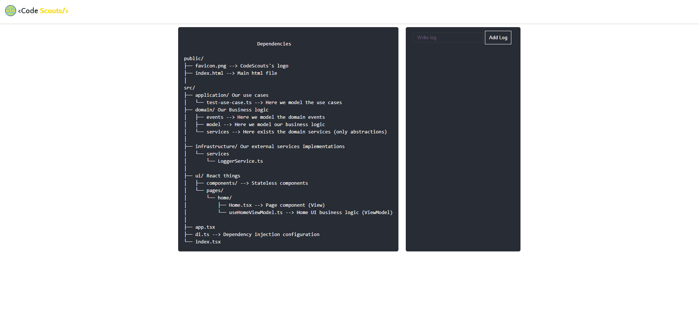

# Intro

Bienvenido a **Library de CodeScouts**, en este sitio encontrarás documentación a nuestra librería de UI para implementar [**Clean architecture**](./clean-architecture) en Frontend, por el momento con [**React**](https://reactjs.org/), aunque estamos trabajando para implementarla en [**Svelte**](https://svelte.dev/) y [**VueJS**](https://vuejs.org/)

Nuestro reto es enseñarte a implementarla en **no más de 5 minutos**. Vamos 🚀

## Disclaimer

Estas librerías se encuentran en permanente cambio, trabajamos con [semantic versioning](https://semver.org/) para evitar breaking changes en tu código, y te invitamos a que reportes issues en caso que lo detectes.

## Conocimiento previo

Tal como estás leyendo, estas librerías te permiten implementar una arquitectura limpia en tu frontend, para que puedas testear, mantener y escalar más rápido tu software.

### Clean architecture

Si no sabes que es **Clean architecture** o quieres profundizar más al respecto, te recomendamos que primero leas este post [**Clean architecture**](./clean-architecture)
antes de continuar.

## Comencemos

Para poder implementar nuestra librería tienes dos opciones.

### Crea una nueva web con (React)

```bash
npm create vite@latest my-vue-app -- --template react-ts
```

### Utiliza nuestro template (Create react app)

```bash
npx create-react-app my-app --template @codescouts/clean-architecture-template
```

Si utilizas nuestro template verás algo así 👇

